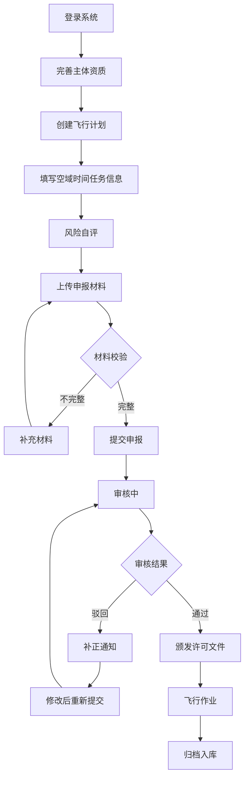

## 1. 产品概述

低空飞行合规申报 Web 系统是面向企业和个人用户的低空作业备案管理平台，提供从资质认证、计划申报、材料上传到审核跟踪的全流程数字化服务，解决传统申报流程繁琐、信息不对称、进度不透明等痛点。

- **目标用户**：通用航空企业、无人机运营企业、个人飞行爱好者、民航监管部门
- **核心价值**：提升申报效率、规范作业流程、加强监管透明度、保障低空飞行安全

## 2. 核心功能

### 2.1 用户角色

| 角色 | 注册方式 | 核心权限 |
|------|----------|----------|
| 个人用户 | 手机号+实名认证 | 个人飞行计划申报、资质管理、进度跟踪 |
| 企业用户 | 企业信息+法人授权 | 企业飞行计划申报、飞行器管理、多操作员授权 |
| 审核人员 | 后台分配 | 申报审核、补正通知、许可签发、黑名单管理 |

### 2.2 功能模块

1. **申报首页**：系统概览、快捷入口、申报统计、通知提醒
2. **主体资质**：实名认证、企业信息、飞行器绑定、资质证书管理
3. **飞行计划**：空域选择、时间设置、任务类型、风险自评、草稿保存
4. **材料上传**：附件上传、格式校验、材料清单、预览下载
5. **审核流转**：进度追踪、审核意见、补正通知、变更/撤销申请
6. **消息中心**：系统通知、审核消息、到期提醒、黑名单提示
7. **历史档案**：申报记录、许可文件、历史查询、数据导出
8. **监管查询**：空域查询、飞行记录、黑名单查询、统计报表

### 2.3 页面详情

| 页面名称 | 模块名称 | 功能描述 |
|-----------|-----------|---------------------|
| 申报首页 | 数据概览 | 展示待审核、已通过、已驳回数量，申报成功率统计 |
| 申报首页 | 快捷操作 | 一键新建申报、草稿继续、资质管理入口 |
| 申报首页 | 通知栏 | 最新消息、到期提醒、系统公告轮播展示 |
| 主体资质 | 实名认证 | 姓名、身份证号、人脸核验、证件上传 |
| 主体资质 | 企业授权 | 企业信息、统一社会信用代码、法人授权书、操作员管理 |
| 主体资质 | 飞行器管理 | 飞行器型号、注册号、适航证、绑定/解绑操作 |
| 飞行计划 | 空域时间 | 空域地图选择、飞行高度、起止时间、频次设置 |
| 飞行计划 | 任务类型 | 航拍、测绘、巡检、表演、训练等任务分类选择 |
| 飞行计划 | 风险自评 | 风险等级问卷、自动评分、风险提示与建议 |
| 材料上传 | 附件管理 | 多文件上传、拖拽上传、进度显示、格式校验 |
| 材料上传 | 材料清单 | 必传/选传材料分类、缺失提醒、材料模板下载 |
| 审核流转 | 进度追踪 | 申报状态时间轴、当前节点、预计完成时间 |
| 审核流转 | 审核意见 | 各级审核意见展示、补正要求详情 |
| 审核流转 | 操作区 | 变更申请、撤销申请、许可文件下载 |
| 消息中心 | 消息分类 | 系统通知、审核消息、到期提醒、安全警示 |
| 消息中心 | 消息详情 | 消息内容、关联申报、一键跳转处理 |
| 历史档案 | 申报记录 | 多条件筛选、分页列表、详情查看 |
| 历史档案 | 许可管理 | 许可文件下载、到期时间、续期提醒 |
| 监管查询 | 空域查询 | 空域分类、禁飞区、限制区可视化展示 |
| 监管查询 | 黑名单 | 违规记录查询、处罚详情、申诉入口 |

## 3. 核心流程

### 3.1 申报主流程

用户提交申报后，系统自动校验材料完整性，进入初审环节。审核通过后颁发电子许可文件，驳回则发送补正通知。用户可在审核前申请变更或撤销。

## 4. 用户界面设计

### 4.1 设计风格

- **主色调**：深蓝色系（#165DFF），代表专业、信任、科技感
- **辅助色**：成功绿（#00B42A）、警告橙（#FF7D00）、危险红（#F53F3F）
- **中性色**：深灰（#1D2129）、中灰（#4E5969）、浅灰（#C9CDD4）、背景（#F2F3F5）
- **按钮风格**：圆角 4px，主次分明，悬停有微妙光影变化
- **字体**：标题使用思源黑体 Bold，正文使用思源黑体 Regular，确保中文显示优美
- **布局风格**：顶部导航 + 侧边栏 + 内容区三栏布局，卡片式设计，信息层次清晰
- **图标风格**：线性图标为主，关键操作使用面性图标增强视觉引导

### 4.2 页面设计概览

| 页面名称 | 模块名称 | UI 元素 |
|-----------|-----------|----------|
| 申报首页 | 数据概览 | 统计卡片、渐变背景、数字动画、趋势小图表 |
| 申报首页 | 快捷操作 | 图标卡片、悬停上浮、阴影过渡 |
| 主体资质 | 信息卡片 | 分步表单、进度指示器、验证状态徽章 |
| 飞行计划 | 表单区域 | 标签页分组、日历选择器、地图选择器 |
| 材料上传 | 上传区域 | 拖拽框、文件列表、进度条、缩略图预览 |
| 审核流转 | 进度时间轴 | 垂直时间轴、状态节点、连接线动画 |
| 消息中心 | 消息列表 | 分类标签、未读红点、消息气泡 |
| 历史档案 | 数据表格 | 筛选器、分页、操作列、行悬停高亮 |
| 监管查询 | 地图展示 | 多层级地图、空域色块、图例说明 |

### 4.3 响应式设计

- **设计原则**：桌面优先，适配平板和移动端
- **断点设置**：1440px（桌面）、1024px（平板横屏）、768px（平板竖屏）、375px（手机）
- **移动端适配**：侧边栏收起为汉堡菜单，表格转为卡片列表，表单单列排布
- **触摸优化**：按钮最小点击区域 44px，重要操作增加确认步骤

### 4.4 交互动效

- **页面加载**：骨架屏占位，内容渐入显示
- **表单交互**：输入框聚焦动效，验证错误震动提示
- **状态变化**：审核状态变更时高亮闪烁，数字滚动动画
- **悬停效果**：卡片轻微上浮，按钮背景色渐变
- **通知动效**：消息从顶部滑入，停留 5 秒后自动收起
