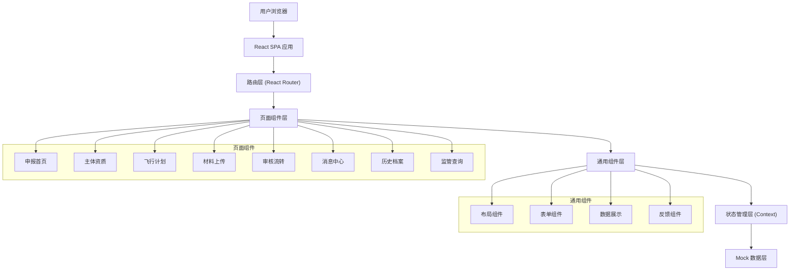
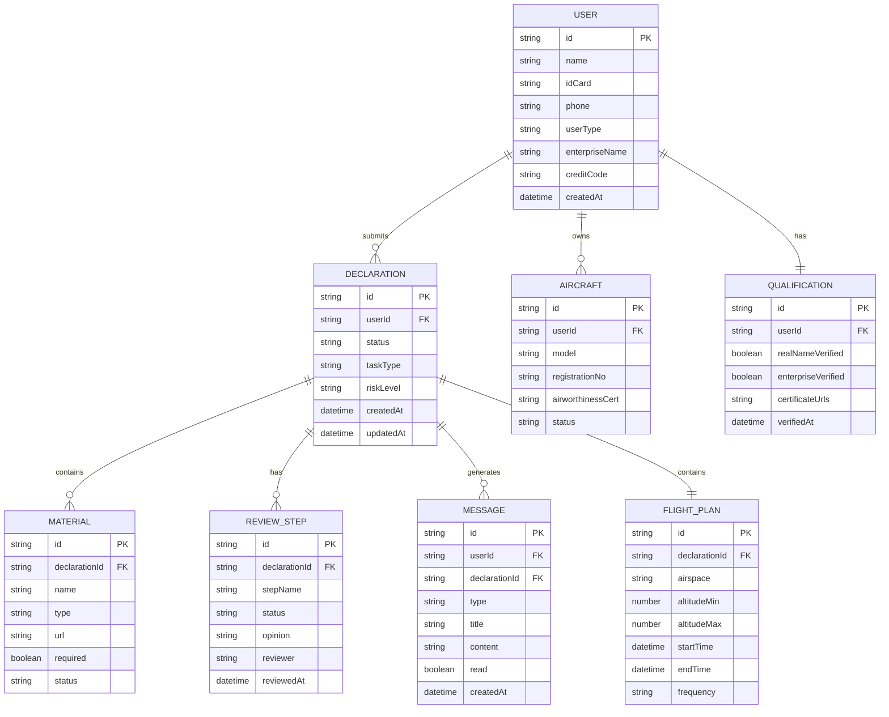

## 1. 架构设计

本系统采用纯前端架构，使用 Mock 数据模拟后端接口，专注于用户界面和交互体验的实现。



## 2. 技术描述

- **前端框架**：React 18 + TypeScript
- **构建工具**：Vite 5.x
- **样式方案**：TailwindCSS 3.x
- **路由管理**：React Router Dom 6.x
- **状态管理**：React Context API（轻量级方案）
- **图标库**：Lucide React
- **UI 组件**：基于 TailwindCSS 自定义构建，不引入重型组件库
- **数据方案**：本地 Mock 数据 + LocalStorage 持久化
- **图表库**：Recharts（用于数据统计展示）

## 3. 路由定义

| 路由路径 | 页面名称 | 说明 |
|----------|----------|------|
| / | 申报首页 | 系统首页，数据概览和快捷入口 |
| /qualification | 主体资质 | 实名认证、企业授权、飞行器管理 |
| /flight-plan | 飞行计划 | 新建/编辑飞行计划，空域时间填写 |
| /materials | 材料上传 | 申报材料上传和校验 |
| /review | 审核流转 | 申报进度跟踪、审核意见查看 |
| /messages | 消息中心 | 系统通知、审核消息、到期提醒 |
| /archive | 历史档案 | 历史申报记录、许可文件管理 |
| /supervision | 监管查询 | 空域查询、黑名单查询 |

## 4. 核心数据模型

### 4.1 数据模型 ER 图



### 4.2 核心类型定义

```typescript
// 用户类型
type UserType = 'personal' | 'enterprise';

interface User {
  id: string;
  name: string;
  idCard: string;
  phone: string;
  userType: UserType;
  enterpriseName?: string;
  creditCode?: string;
  avatar?: string;
}

// 申报状态
type DeclarationStatus = 'draft' | 'submitted' | 'reviewing' | 'correction' | 'approved' | 'rejected' | 'revoked';

// 任务类型
type TaskType = 'aerial_photography' | 'mapping' | 'inspection' | 'performance' | 'training' | 'other';

// 风险等级
type RiskLevel = 'low' | 'medium' | 'high';

interface Declaration {
  id: string;
  userId: string;
  title: string;
  status: DeclarationStatus;
  taskType: TaskType;
  riskLevel: RiskLevel;
  riskScore: number;
  createdAt: string;
  updatedAt: string;
  flightPlan?: FlightPlan;
  materials?: Material[];
  reviewSteps?: ReviewStep[];
}

interface FlightPlan {
  id: string;
  declarationId: string;
  airspace: string;
  airspaceName: string;
  altitudeMin: number;
  altitudeMax: number;
  startTime: string;
  endTime: string;
  frequency: string;
  aircraftIds: string[];
}

interface Material {
  id: string;
  declarationId: string;
  name: string;
  type: string;
  url: string;
  size: number;
  required: boolean;
  status: 'uploaded' | 'verified' | 'rejected';
}

interface ReviewStep {
  id: string;
  declarationId: string;
  stepName: string;
  stepOrder: number;
  status: 'pending' | 'processing' | 'completed' | 'rejected';
  opinion?: string;
  reviewer?: string;
  reviewedAt?: string;
}

interface Message {
  id: string;
  userId: string;
  declarationId?: string;
  type: 'system' | 'review' | 'expiry' | 'warning';
  title: string;
  content: string;
  read: boolean;
  createdAt: string;
}

interface Aircraft {
  id: string;
  userId: string;
  model: string;
  registrationNo: string;
  airworthinessCert: string;
  status: 'bound' | 'unbound' | 'expired';
  boundAt: string;
}
```

## 5. 项目目录结构

```
src/
├── assets/              # 静态资源
│   ├── images/
│   └── icons/
├── components/          # 通用组件
│   ├── layout/         # 布局组件
│   │   ├── Header.tsx
│   │   ├── Sidebar.tsx
│   │   └── Layout.tsx
│   ├── form/           # 表单组件
│   │   ├── FormItem.tsx
│   │   ├── Upload.tsx
│   │   └── DatePicker.tsx
│   ├── ui/             # 基础 UI 组件
│   │   ├── Button.tsx
│   │   ├── Card.tsx
│   │   ├── Modal.tsx
│   │   ├── Table.tsx
│   │   └── Tabs.tsx
│   └── common/         # 业务通用组件
│       ├── StatusBadge.tsx
│       ├── Timeline.tsx
│       └── EmptyState.tsx
├── pages/              # 页面组件
│   ├── Home/
│   ├── Qualification/
│   ├── FlightPlan/
│   ├── Materials/
│   ├── Review/
│   ├── Messages/
│   ├── Archive/
│   └── Supervision/
├── context/            # 状态管理
│   ├── UserContext.tsx
│   └── DeclarationContext.tsx
├── data/               # Mock 数据
│   ├── mockUser.ts
│   ├── mockDeclarations.ts
│   ├── mockMessages.ts
│   └── mockAircraft.ts
├── types/              # TypeScript 类型定义
│   └── index.ts
├── utils/              # 工具函数
│   ├── format.ts
│   ├── storage.ts
│   └── validation.ts
├── App.tsx
├── main.tsx
└── index.css
```

## 6. 状态管理设计

使用 React Context API 实现轻量级状态管理，避免引入 Redux 等重型库：

1. **UserContext**：管理用户信息、认证状态、资质信息
2. **DeclarationContext**：管理申报列表、当前申报、草稿状态
3. **MessageContext**：管理消息列表、未读计数

数据持久化使用 LocalStorage，确保页面刷新后数据不丢失。
